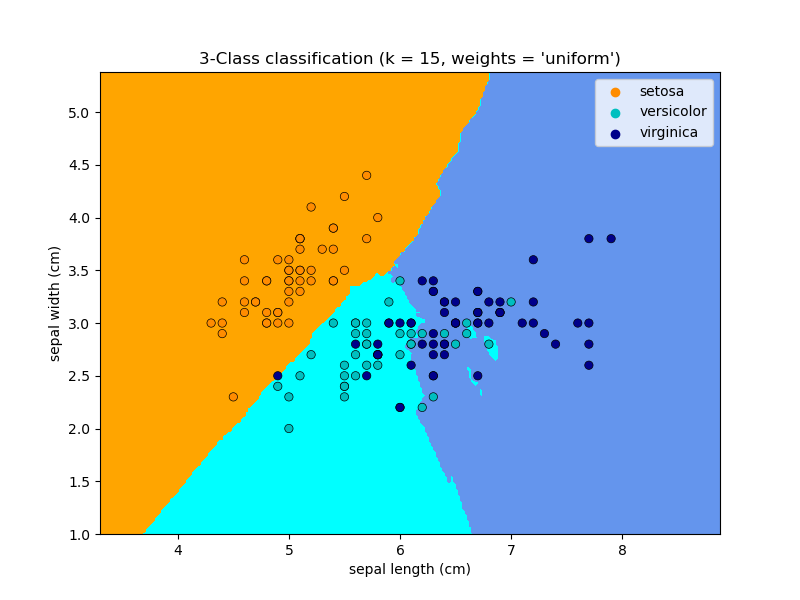

# SIMPLE KNN METHOD IMPLEMENTATION
## What is KNN?
Is a supervised machine learning algorithm that can be used to solve both classification and regression problems. 
The KNN algorithm assumes that similar things exist in close proximity. In other words, similar things are near to each other. For this algorithm, a point in space is assigned to class C, if this is the most frequent class among the k closest elements.

For more information, go to: [K-Nearest-Neighbors](https://www.analyticsvidhya.com/blog/2018/03/introduction-k-neighbours-algorithm-clustering/)

Figure 1: Example of KNN

## Dataset used for this project
Biomedical data set built by Dr. Henrique da Mota during a medical residence period in the Group of Applied Research in Orthopaedics (GARO) of the Centre Médico-Chirurgical in Lyon, France. For this project, I have used the data provided for a specific tastk that consists in classifying patients as belonging to one out of three categories: Normal (100 patients), Disk Hernia (60 patients) or Spondylolisthesis (150 patients). 

### Pelvic Incidence
Pelvic incidence is defined as the angle between a line perpendicular to the sacral plate at its midpoint and a line connecting this point to the femoral head axis.
### Pelvic Tilt
Is the orientation of the pelvis in respect to the thighbones and the rest of the body. The pelvis can tilt towards the front, back, or either side of the body.
### Lumbar Lordosis Angle
Is an ideal parameter for the evaluation of lumbar lordosis. The normal value of LLA can be defined as 20-45 degrees
### Sacral Slope
Is defined as the angle between the horizontal and the sacral plate, and is a critical spinal parameter in the analysis of sagittal balance that has been correlated to the progression of spondylolisthesis. [1]
### Pelvis Radius
The distance from the hip axis to the posterior-superior corner of the S1 endplate.
### Grade of spondylolisthesis
Spondylolisthesis is a spinal condition that affects the lower vertebrae (spinal bones). This disease causes one of the lower vertebrae to slip forward onto the bone directly beneath it. Is graded by measuring how much of a vertebral body has slipped forward over the body beneath it. [2]
#### What is normal?
The value for the pelvic incidence was provided as normal between 43° and 62°. The normal range of value for the sacral slope was from −32° to −49°, from 3° to 18° for the pelvic tilting. [3]

Figure 2: How to get pelvic Parameters

# How to run the project
## Prerequisites
- Have pandas installed
- Python 3.6>
- Have sklearn installed

## Run the project
Run this command: 
python3 knn.py

The first output belongs to a sneak peak to the dataset, its columns and its values.
Then some explanation for what does the name of the column stands for. A deeper explanations for each one is found on this document.
The accuracy of the model (according to the testing subset and its corresponding prediction) is also shown.

Then, a menu with two options is printed.
- Predict for input: The program will ask an input for each of the features of the instance(6). After every number is entered, it will show the prediction for that group of values using the trained model.
- Compare prediction to actual value: For this option you need to enter the number of a row between 0-309 and the program will show the actual value of the class for those features and the value predicted by the model.

## References:
[1] Bollini G., Legaye J., Tardieu C. (2014) Pelvic Incidence: A Predictive Factor for Three-Dimensional Acetabular Orientation— A Preliminary Study. [Online] Available: [https://www.hindawi.com/journals/ari/2014/594650/](https://www.hindawi.com/journals/ari/2014/594650/)

[2] Moore K. (Sept. 29, 2018) What is spondylolisthesis? [Online] Available: [https://www.healthline.com/health/spondylolisthesis](https://www.healthline.com/health/spondylolisthesis)

[3] European Spine Journal (2007) The femoro-sacral posterior angle: an anatomical sagittal pelvic parameter usable with dome-shaped sacrum. [Online] Available: [https://www.ncbi.nlm.nih.gov/pmc/articles/PMC2200679/] (https://www.ncbi.nlm.nih.gov/pmc/articles/PMC2200679/) 