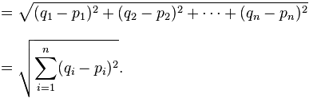

# KNN Implementation

## How does KNN work?
Is a supervised machine learning algorithm that can be used to solve both classification and regression problems. 
The KNN algorithm assumes that similar things exist in close proximity. In other words, similar things are near to each other. For this algorithm, a point in space is assigned to class C, if this is the most frequent class among the k closest elements.

To get the distance for the neighbours the **euclidean distance formula** which states:

Where _n_ represents the dimensions of our model. 

Is important to say that this algorithm is better for those datasets that contain a small amount of dimensions (2-4) because when more dimensions are considered, we may fall into **Curse of dimensionality**.

### Curse of Dimensionality
Curse of Dimensionality refers to a set of problems that arise when working with high-dimensional data. The dimension of a dataset corresponds to the number of attributes/features that exist in a dataset. A dataset with a large number of attributes, generally of the order of hundred or more, is referred to as high dimensional data. Some of the difficulties that come with high dimensional data manifest during analyzing or visualizing the data to identify patterns, and some manifest while training machine learning models. The difficulties related to training machine learning models due to high dimensional data is referred to as ‘Curse of Dimensionality’. The popular aspects of curse of dimensionality are ‘data sparsity’ and ‘distance concentration’.

For more information go to: [Curse of Dimensionality](https://www.mygreatlearning.com/blog/understanding-curse-of-dimensionality/)

## Dataset used
This is data obtained from costumers from Kossina Cloud (Dark Kitchen). Sensitive data has been changed for dummy data in order to mantain privacy. 
The columns we are using for this are "orderTotal" and "c_percent".
OrderTotal represents the amount of money spent in the period of the dataset
c_percent represents the percentage of orders in which the client ordered more than one product. 
The goal for this program is to predict the class in which the client would fit according to his consumption. The classes are:
- Sin rank
- Bronce
- Plata
- Oro
- Platino
- Diamante

## KNN Class

## eu_dis(x1, x2)
This method takes 2 arrays of numbers as "points" and performs the euclidean distance formula with them, returning the distance between them.
### k
_k_ atribute of this class represents the number of neighbors to take into consideration when making the classification. This parameter needs to be passed when instanciating the class.

### fit (X, y)
As the algorithm does not need a "training" process like other, with this method we are only assigning the X values and the targets with which we are going to do the comparisson and then the clasification.

### predict(X) and _predict(x)
Here is where everything happens. Here, we take an array as a point and compute the distance between this point and every single point on the X_train subset and store them into an array. 
Then, we sort that array(asc) and take only the _k_ first positions, those will be the indexes of the k nearest neighbors. 
After that, we obtain the clasiffication (target) of those indexes using the y_train subset and store them in an array.
Then, we count which label is the more repeated one in this array and we return it as the predicted clasification for the given point.

# How to run the project
## Prerequisites
- Have pandas installed
- Python 3.6>
- Have sklearn installed

## Run the project
Run this command: 
python3 knn_testing.py

First you need to introduce the name of the csv file to read. 
Then, the terminal will ask you to enter the value for k 
Predictions for the y_testing subset using this dataset and k will be shown as the accuracy of the model too.

The program now will ask if you want to make a prediction, if so, you will need to enter the values for orderTotal and the c_percentage, after that, the veredict for those values will be printed. 

## References:
[1] Great Learning Team (2020). Understanding Curse of Dimensionality. [Online] Available [https://www.mygreatlearning.com/blog/understanding-curse-of-dimensionality/](https://www.mygreatlearning.com/blog/understanding-curse-of-dimensionality/)